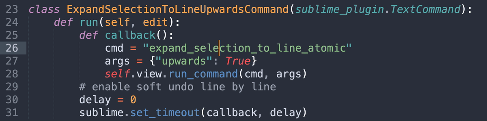

# Expand Selection to Line Upwards

> A Sublime Text plugin that expands selection to line upwards or downwards.



*^ Upward and downward expansions, and their undos.*

## Install

[Package Control](https://packagecontrol.io/packages/Expand%20Selection%20to%20Line%20Upwards)

## How to Use

### 1. Key Bindings

No default key bindings. Define your own.

#### Recommended Key Bindings

```
{ "keys": ["primary+i"], "command": "expand_selection_to_line_upwards" },
{ "keys": ["primary+l"], "command": "expand_selection_to_line_downwards" },
{ "keys": ["primary+shift+l"], "command": "shrink_selection_by_line_upwards" },
{ "keys": ["primary+shift+i"], "command": "shrink_selection_by_line_downwards" },
```

| Command                            | Windows / Linux                                   | macOS                                            |
| ---------------------------------- | ------------------------------------------------- | ------------------------------------------------ |
| Expand Selection to Line Upwards   | <kbd>Ctrl</kbd> + <kbd>I</kbd>                    | <kbd>Cmd</kbd> + <kbd>I</kbd>                    |
| Expand Selection to Line Downwards | <kbd>Ctrl</kbd> + <kbd>L</kbd>                    | <kbd>Cmd</kbd> + <kbd>L</kbd>                    |
| Shrink Selection by Line Upwards   | <kbd>Ctrl</kbd> + <kbd>Shift</kbd> + <kbd>L</kbd> | <kbd>Cmd</kbd> + <kbd>Shift</kbd> + <kbd>L</kbd> |
| Shrink Selection by Line Downwards | <kbd>Ctrl</kbd> + <kbd>Shift</kbd> + <kbd>I</kbd> | <kbd>Cmd</kbd> + <kbd>Shift</kbd> + <kbd>I</kbd> |

### 2. Main Menu

```
Selection > Expand Selection to Line Upwards
Selection > Expand Selection to Line Downwards
Selection > Shrink Selection by Line Upwards
Selection > Shrink Selection by Line Downwards
```

### 3. Command Palette

```
Expand Selection to Line Upwards
Expand Selection to Line Downwards
Shrink Selection by Line Upwards
Shrink Selection by Line Downwards
```

## Author

Aaron Fu Lei

## License

MIT
