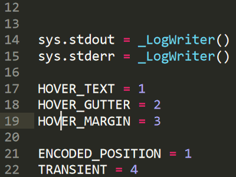

Expand Selection to Line Upwards
================================
A Sublime Text 3 plugin.

Like the built-in `Expand Selection to Line` command, but expands upwards instead of downwards.



Install
-------
Package Control.

Search for [Expand Selection to Line Upwards](https://packagecontrol.io/packages/Expand%20Selection%20to%20Line%20Upwards).

How to Use
----------
- **Keyboard Shortcut**

    - Windows / Linux

        <kbd>Ctrl</kbd> + <kbd>Alt</kbd> + <kbd>L</kbd>

    - macOS

        <kbd>Cmd</kbd> + <kbd>Opt</kbd> + <kbd>L</kbd>

- **Main Menu**

    `Selection > Expand Selection to Line Upwards`

- **Command Palette**

    `Expand Selection to Line Upwards`

Customize Keyboard Shortcut
---------------------------
You can set up your own keyboard shortcut in `Preferences > Key Bindings`.

For example,

- Windows / Linux

```
{ "keys": ["ctrl+shift+l"], "command": "expand_selection_to_line_upwards" },
{ "keys": ["ctrl+alt+l"], "command": "split_selection_into_lines" },
```

- macOS

```
{ "keys": ["super+shift+l"], "command": "expand_selection_to_line_upwards" },
{ "keys": ["super+alt+l"], "command": "split_selection_into_lines" },
```

What If I Over-expanded?
------------------------
Use `Soft Undo`.

- Windows / Linux

    <kbd>Ctrl</kbd> + <kbd>U</kbd>

- macOS

    <kbd>Cmd</kbd> + <kbd>U</kbd>

Author
------
Aaron Fu Lei

License
-------
MIT
